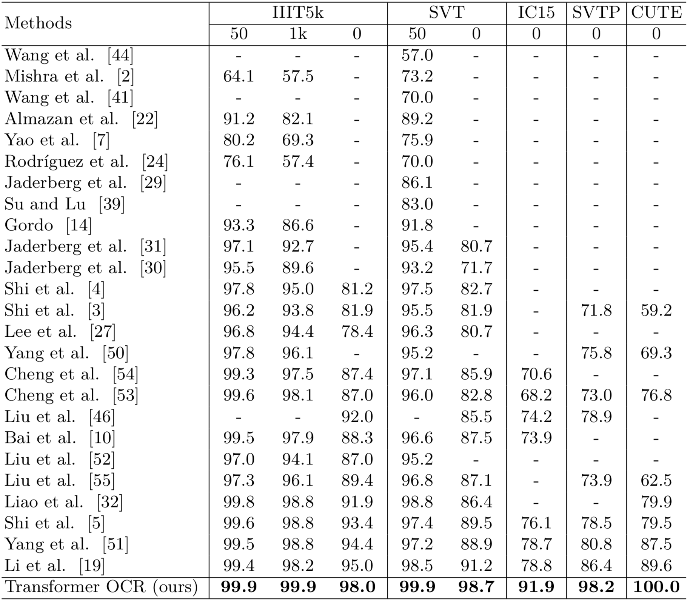

Spatial Attention Is All You Need for Scene Text Recognition with Arbitrary Shapes

model architecture:

Results across a number of methods and datasets:

Heat map of the source attention (encoder memory) score of the first layer of decoder:

The transformer source code from:http://nlp.seas.harvard.edu/2018/04/03/attention.html
