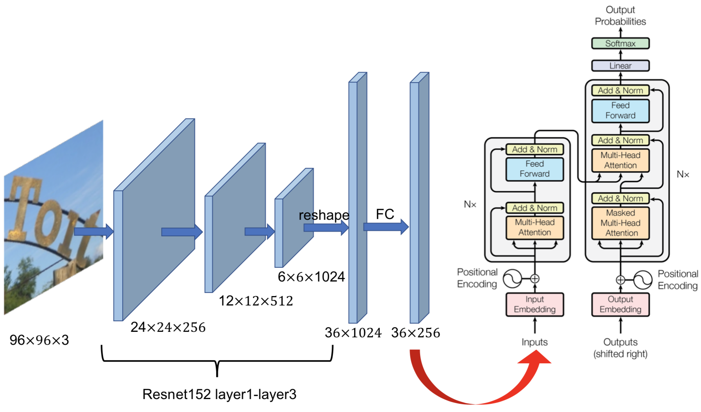
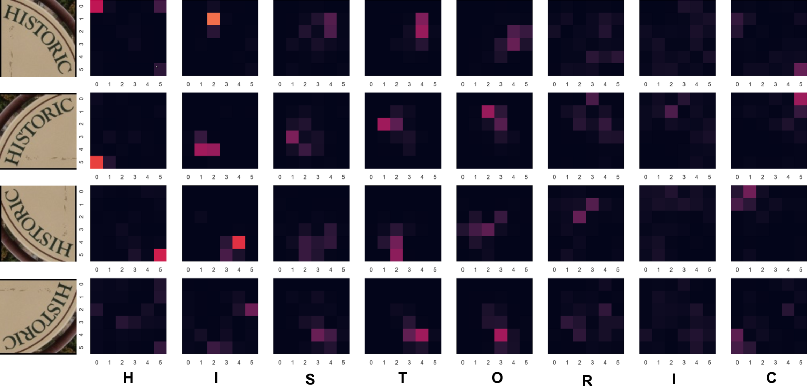

We realized that the code of computing loss is problemtic, which is directly borrowed from http://nlp.seas.harvard.edu/2018/04/03/attention.html#loss-computation. We are revising the code and conducting new experiments. To aovid misleading others, we have withdrawed the arXiv paper.  We will decide whether submit a new paper to arXiv according to the new experments.
## model architecture:

## Heat map of the source attention (encoder memory) score of the first layer of decoder:

## The transformer source code from:http://nlp.seas.harvard.edu/2018/04/03/attention.html
